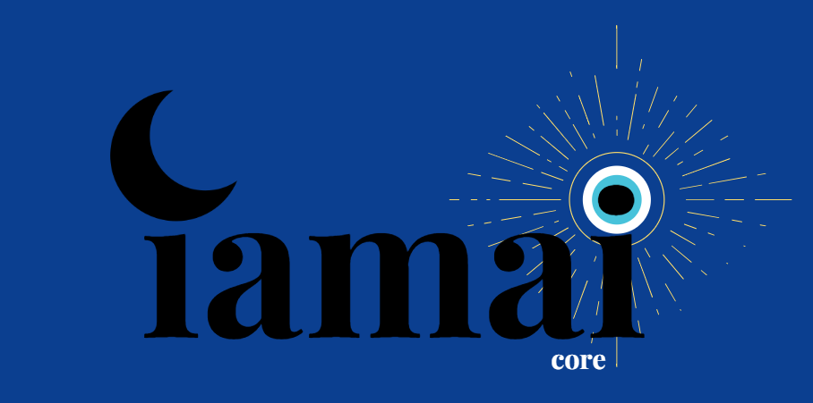

# iamai-core

----

## Personal AI, Simply Yours

iamai-core is free, open-source personal AI that runs entirely on your own device, learns from your interactions, and keeps everything private. No cloud services, no data sharing, no complex setup - just download and start.

## What Makes iamai-core Different?

In the world of local AI, there's a stark divide: complex tools for developers or simple website apps that lack capability. iamai-core bridges this gap by being both a straightforward AI application and a set of easy-to-use developer plugins.

- **Fully Local Operation**: Works without internet, portable, disaster-proof
- **Live Training Approach**: Learns continuously from your interactions
- **Complete Privacy**: Your data stays on your device
- **Cross-Platform**: Supports Windows, macOS, Linux and phone integration
- **Developer-Friendly**: C/C++ core with React/Next.js GUI and game engine plugins
- **Multimodal**: Text, audio, and visual interfaces

## Core Architecture

Our technology is built around three main components:
1. **Core neural network** ("brain")
2. **Data modality I/O systems** ("senses")
3. **Traditional programming interfaces** ("tools")

The technical implementation combines high-performance core systems written in C/C++, with a modern frontend built using JavaScript and React, allowing for seamless integration of text, audio, and visual interfaces.

## Technical Implementation

- Standalone cross-platform C++ CMAKE app
- Static Next.js/React app GUI
- GUI files served using Crow
- WebSockets between C++ and GUI
- ZeroMQ push/pull queues for communication
- SQLite for data storage
- JNI native Android app (text chat, earbud audio interface)

## Product Roadmap

We're building iamai-core in phases:

1. **Foundation**: Local text chat companion
2. **Multimodal Expansion**: Voice and image capabilities
3. **Personal Knowledge Integration**: Document and social media integration
4. **Continual Learning Framework**: Real-time learning from interactions
5. **Agentic Desktop Assistant**: Screen understanding and PC interaction
6. **Latent Pool Protocol**: Secure peer-to-peer AI communication

[Detailed Product Roadmap](roadmap.md)

## Get Involved

### Contribute

- Fork the repo, make your changes, submit a pull request
- Join our Discord to discuss the project: [Discord](https://discord.gg/6TdQR7Ht3U)

### Support the Project

Help keep personal AI truly personal by supporting iamai-core:

- **GitHub Sponsors**:
  - View the sponsorship tiers and rewards: [Sponsor](https://github.com/sponsors/iamai-core) 
- **Crypto Donations**:
  - Bitcoin: bc1qyvmjamjtt5f20q0k8nkkurdcjlyd8ptaag4qq7
  - Ethereum/Arbitrum/Base/Tokens: 0x26827CcE25992d47180aAD75f3E69cb57D71602B
- **Morpheus Staker Benefits**: Get early access to builds and direct input on features
  - If you have [[MorpheusAI](https://mor.org)] Base Network [[MOR](https://app.uniswap.org/explore/tokens/base/0x7431ada8a591c955a994a21710752ef9b882b8e3)] tokens, you can stake them on the iamai-core [[Builder Subnet](https://dashboard.mor.org/#/builders/0x4501d4e79230adce800ff26e5d2e2ae061f1e54da8508fe17dd1462388fb8373?chain=8453&network=mainnet)] page.

## Sponsors - Thank You!
- [MorpheusAI](https://mor.org)

---

**Free & Local AI for Everyone**
